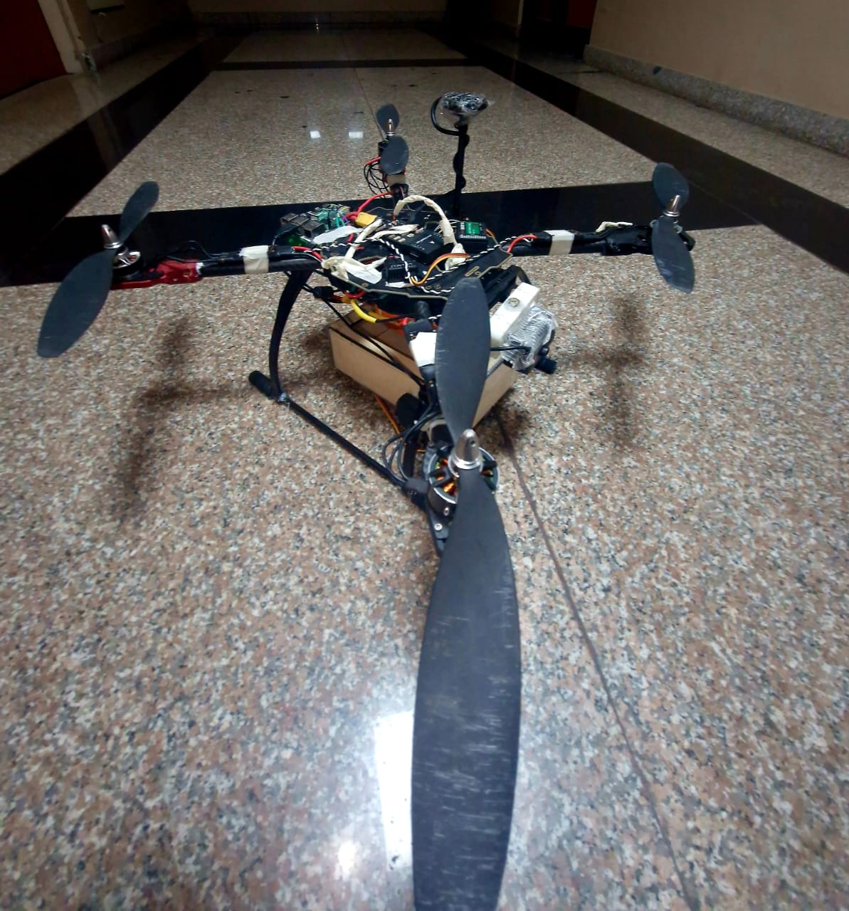
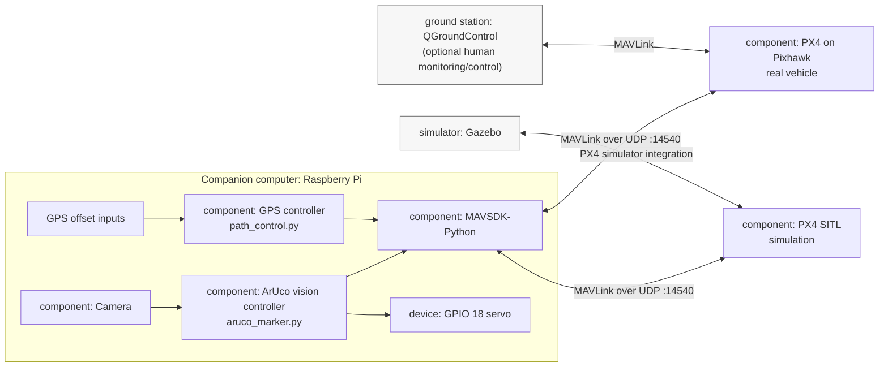
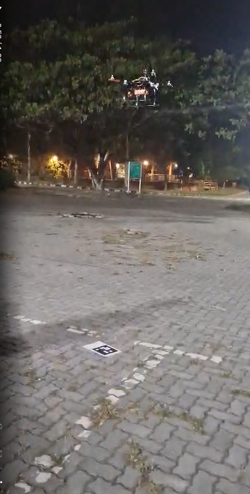

# Aero Delivers



## UML Component Diagram



The MAVSDK links to the real Pixhawk and PX4 SITL are alternative configurations; only one flight-control target should be connected for a run. These scripts communicate with PX4 through MAVSDK/MAVLink.

Experimental quadrotor delivery project with two independent flight-control workflows:

- Camera-based ArUco target approach and a GPIO servo payload mechanism.
- GPS-coordinate navigation using MAVSDK-Python, with landing delegated to the autopilot.

The project team reports that this code has been tested and flight-validated on the project aircraft. That validation applies to the tested hardware, firmware, and configuration; the vision and GPS workflows are separate programs, and neither currently switches between the two methods.

## Hardware and Software

The intended companion-computer setup is a Raspberry Pi connected to a Pixhawk flight controller, a camera available to OpenCV, and a servo connected to Raspberry Pi GPIO pin 18 (BCM numbering). The flight controller must provide the MAVLink connection expected by MAVSDK. Both MAVSDK scripts currently connect to `udp://:14540`; configure the simulator or MAVLink routing for that endpoint before running either script.

Python dependencies used by the source:

```bash
python3 -m pip install mavsdk opencv-contrib-python numpy
```

`RPi.GPIO` is also required by `aruco_marker.py` and is intended for Raspberry Pi OS. Install it using the supported package method for the OS image in use. The standalone marker tools do not import MAVSDK or GPIO.

## Scripts

| Script | Purpose |
| --- | --- |
| `aruco_marker.py` | Connects to MAVSDK, uploads and runs a fixed mission item, then opens camera device 0 and detects `DICT_5X5_100` markers. It estimates marker pose, sends offboard position setpoints, operates the GPIO servo, and requests return-to-launch. |
| `path_control.py` | Connects to MAVSDK, reads the GPS origin, flies to a latitude/longitude offset at a requested relative altitude, and calls the autopilot land action. It then attempts a return-to-origin flight. |
| `arucodist.py` | Opens camera device 0, detects `DICT_4X4_50` markers, estimates their distance using `solvePnP`, and displays the annotated camera view. This is a vision-only utility; it does not control the drone. |
| `arucogenerator.py` | Generates and displays marker images for IDs 0 through 4 using `DICT_4X4_50` by default. |

## Run

Run commands from the project directory, on the machine with the required hardware or simulator connection:

```bash
python3 arucogenerator.py
python3 arucodist.py
python3 path_control.py
python3 aruco_marker.py
```

The scripts are standalone alternatives; run only one flight-control script at a time. The camera utilities and vision-control script expect camera device index `0`. Press `q` to exit the camera windows. The GPS demo coordinates in `path_control.py` are small offsets added to the GPS global origin, not absolute latitude/longitude values; update and review them for the test environment.

## Workflows

### ArUco target approach

`aruco_marker.py` waits for connection and global/home position estimates, uploads a fixed mission item, and starts that mission. After the mission completes, it records a local NED position, starts offboard control, and processes camera frames. When it sees a marker, it computes pose from the marker corners and hard-coded camera calibration, then sends position setpoints. The script subsequently commands the servo open and closed and requests return-to-launch.

This script does not issue a `land()` action at the marker. Its marker-relative movement, payload release, and return-to-launch behavior should be understood as implemented; the README's flight-validation statement refers to the project's tested setup and behavior.

### GPS navigation

`path_control.py` adds the supplied latitude and longitude offsets to the GPS global origin, computes an absolute altitude from the current altitude plus the requested relative altitude, arms and takes off, and sends a `goto_location` command. It waits for the target coordinate tolerance and requests `land()`. It then contains a second takeoff and return-to-origin sequence.

This is GPS waypoint navigation with an autopilot land command, not visual precision landing on a target. The checked-in return sequence references an undefined `relative_altitude` name, which raises a `NameError` if execution reaches that statement. If the flight-validated version completes the return leg, confirm that its source/configuration matches this checked-in file.

## Marker and Camera Setup

The marker generator and distance utility use `DICT_4X4_50`; the flight-control vision script detects `DICT_5X5_100`. A marker generated with the default generator settings will therefore not be recognized by `aruco_marker.py`. Select a dictionary and marker ID that match the detector before printing or flying with a marker.

The scripts use different marker-size and camera-calibration values. `arucodist.py` assumes a 5 cm marker and a 1280x720 camera; `aruco_marker.py` estimates pose with a 2 cm marker and a separate hard-coded calibration. Set these values from the actual printed marker and calibrated camera. Camera resolution, mounting orientation, and the conversion between camera coordinates and the aircraft's NED frame must also be verified for the installation.

## Demo Media

Current project media:

- [Quadrotor close-up](drone_image.jpeg)
- [Quadrotor field photo](far_shot.jpeg)
- [Simulation testing video](simulation_testing_video.mp4)
- [Final video](final_video.mp4)

### Real-world ArUco landing



## Safety and Validation

- For reproducing or changing the flight-validated setup, first verify the MAVLink endpoint, flight mode behavior, coordinate frame, geofence, failsafes, and emergency stop; use simulation or remove propellers for initial checks.
- Keep a pilot able to take manual control. Do not test autonomous flight over people or property without authorization and an appropriate safety plan.
- `aruco_marker.py` contains a fixed mission coordinate, assumes GPIO is available, and uses a blocking camera/control loop. Review the mission, servo wiring, calibration, and flight-controller configuration before use.
- The servo helper calls `asyncio.sleep()` without awaiting it, so its intended half-second delay is not performed. Account for this when comparing the checked-in source with the validated payload-release behavior.
- `path_control.py` waits indefinitely for position tolerance and has no timeout or explicit recovery path. Its coordinate tolerance is in degrees and does not represent a fixed ground distance at all latitudes.
- Successful connection or execution of a script is not evidence of safe or accurate landing. Test each stage independently and verify the actual vehicle response.